### Theory

The circuit configuration of single-phase bridge inverter is shown in Fig. 1.

  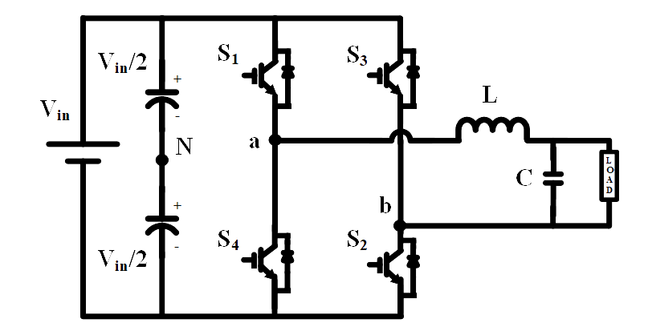
  
Fig. 1. Circuit diagram of single -phase bridge inverter.

 
Based on the operation of switches (S1, S2, S3, S4: ON/OFF-state) the operating principle of the inverter is explained below briefly. All possible switching states are given Table.1.
  

<table border="0" align="center" style="width:100%; border:none;">
  <tr>
    <td>
      
**Switch (S1, S2): ON-state** 

**Switch (S3, S4): OFF-state**
    </td>
    <td>

**Switch (S1, S2): OFF-state**

**Switch (S3, S4): ON-state**  
    </td>
  </tr>
  <tr>
<td style="width:50%">

  
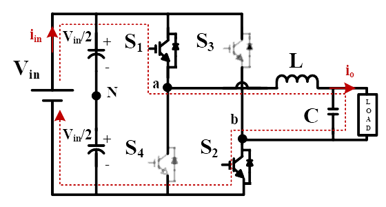
  
Fig. 2(a). Equivalent circuit when S1 and S2 are ON
  

</td>
<td style="width:50%">
  

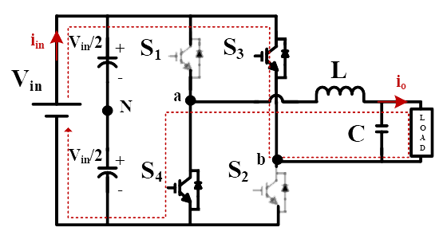
  
Fig. 2(b). when S3 and S4 are ON
  

 
    </td>
  </tr>
</table>
 

 

Table-1. Switch states for full bridge Inverter-Unipolar switching

 

<table align="center" width="100%" >
  <tr style="text-align: center; font-weight: bold; background-color: #c9c9c9;">
    <td style="text-align: center; font-weight: bold;">Switching States</td>
    <td style="text-align: center; font-weight: bold;">S1</td>
    <td style="text-align: center; font-weight: bold;">S2</td>
    <td style="text-align: center; font-weight: bold;">S3</td>
    <td style="text-align: center; font-weight: bold;">S4</td>
    <td style="text-align: center; font-weight: bold;">Vo</td>
  </tr>
  <tr style="background-color: #FFF;">
    <td style="text-align: center; font-weight: bold;">1</td>
    <td style="text-align: center; font-weight: bold;">ON</td>
    <td style="text-align: center; font-weight: bold;">ON</td>
    <td style="text-align: center; font-weight: bold;">OFF</td>
    <td style="text-align: center; font-weight: bold;">OFF</td>
    <td style="text-align: center; font-weight: bold;">Vin</td>
  </tr>
  <tr style="background-color: #FFF;">
    <td style="text-align: center; font-weight: bold;">2</td>
    <td style="text-align: center; font-weight: bold;">OFF</td>
    <td style="text-align: center; font-weight: bold;">OFF</td>
    <td style="text-align: center; font-weight: bold;">ON</td>
    <td style="text-align: center; font-weight: bold;">ON</td>
    <td style="text-align: center; font-weight: bold;">-Vin</td>
  </tr>
  <tr style="background-color: #FFF;">
    <td style="text-align: center; font-weight: bold;">3</td>
    <td style="text-align: center; font-weight: bold;">ON</td>
    <td style="text-align: center; font-weight: bold;">OFF</td>
    <td style="text-align: center; font-weight: bold;">ON</td>
    <td style="text-align: center; font-weight: bold;">OFF</td>
    <td style="text-align: center; font-weight: bold;">0</td>
  </tr>
  <tr style="background-color: #FFF;">
    <td style="text-align: center; font-weight: bold;">4</td>
    <td style="text-align: center; font-weight: bold;">OFF</td>
    <td style="text-align: center; font-weight: bold;">ON</td>
    <td style="text-align: center; font-weight: bold;">OFF</td>
    <td style="text-align: center; font-weight: bold;">ON</td>
    <td style="text-align: center; font-weight: bold;">0</td>
  </tr>
</table>
 

 

  **MULTIPLE-PULSE WIDTH MODULATION (SPWM)**     

  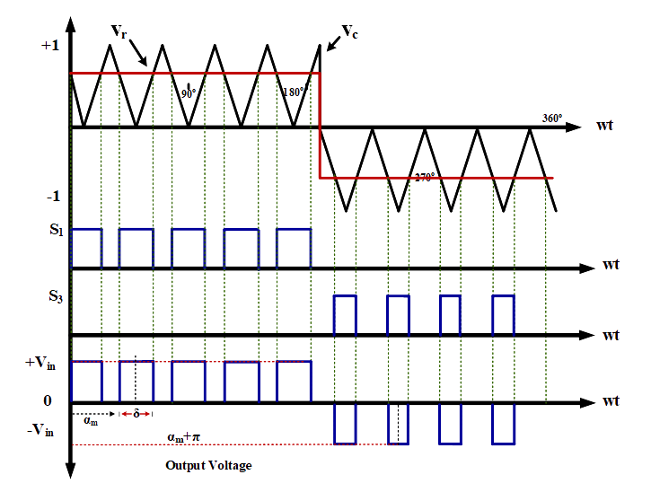
  
Fig. 3. Multi-pulse PWM generation.

 

- The harmonic content can easily be reduced by using several pulses in each half-cycle of output voltage. 
- The generation of gating signals for turning ON and OFF of switches is done by comparing a square wave reference signal with triangular carrier wave.
- The frequency of reference signals sets the output frequency (fo) and the carrier frequency (fc) determines the number of pulses (p) per half-cycle. 
- The modulation index (M) controls the output voltage magnitude.
- This type of modulation is also known as uniform pulse-width modulation (UPWM).
- The number of pulses (p) per half-cycle is:

 

  

    ..(1)

 

 
where “mf=fc/fo” is defined as the frequency modulation ratio.
  

  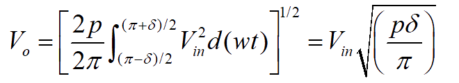
      

    ..(2)

 
- The variation of the modulation index (M) from 0 to 1 varies the pulse width “d” from 0 to “T/2p” (0 to &#8508;/p) and the RMS output voltage (Vo) from “0 to Vin”.
- The general form of load voltage expressed using Fourier series is

 
  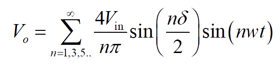
      

    ..(3)

 
The coefficient ‘Bn’ can be found by adding the effects of all pulses (2p).
 

  
      

    ..(4)

 
  
- The pulse width ‘d’ is

 
  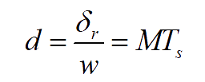
      

    ..(5)

 

 
where Ts=T/2p.
  

**SINUSOIDAL-PULSE WIDTH MODULATION (SPWM)**
 

- For realizing SPWM, a high-frequency triangular carrier wave is compared with a sinusoidal reference of the desired output frequency. 
- The intersection of carrier and reference waveforms determines the switching instants of the devices. 
- The PWM scheme is illustrated in Fig. 4 in which ‘vc’ is the peak value of triangular carrier wave and ‘vr’ that of the reference signal. 
- The switches of the inverter are controlled based on the PWM generated above. 
- When the instantaneous sinusoidal reference magnitude is higher than the triangular carrier magnitude then the PWM signal is high, otherwise it is low.

 
  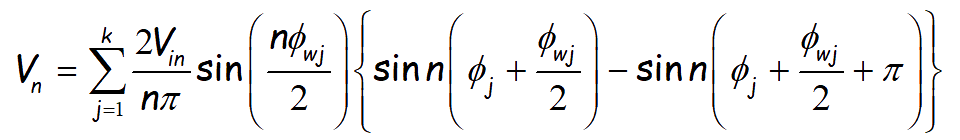
      

    ..(6)

&nbsp;

  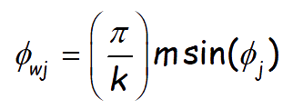
      

    ..(7)

 

&nbsp;     

  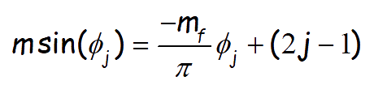
      

    ..(8)

 

&nbsp;     

  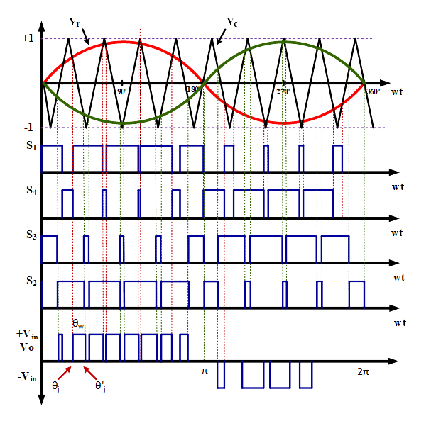
  
Fig. 4. Ideal waveforms for the unipolar SPWM generation.

 
