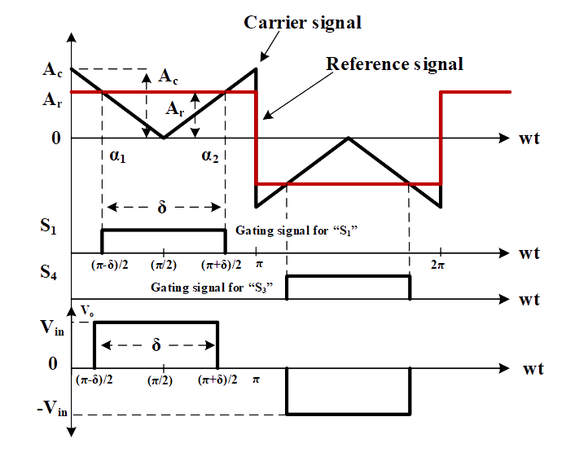

### Theory

The circuit configuration of single-phase bridge inverter is shown in Fig. 1.

  
  
Fig. 1. Circuit diagram of single -phase bridge inverter.

 
Based on the operation of switches (S1, S2, S3, S4: ON/OFF-state) the operating principle of the inverter is explained below briefly. All possible switching states are given Table.1.
  

<table border="0" align="center" style="width:100%; border:none;">
  <tr>
    <td>
      
**Switch (S1, S2): ON-state** 

**Switch (S3, S4): OFF-state**
    </td>
    <td>

**Switch (S1, S2): OFF-state**

**Switch (S3, S4): ON-state**  
    </td>
  </tr>
  <tr>
<td style="width:50%">

  

  
Fig. 2(a). Equivalent circuit when S1 and S2 are ON
  

</td>
<td style="width:50%">
  

  
Fig. 2(b). when S3 and S4 are ON
  

 
    </td>
  </tr>
</table>
 

 
Table-1. Switch states for single-phase bridge inverter (Unipolar switching)
  

<table align="center">
  <tr style="text-align: center; font-weight: bold; background-color: #c9c9c9;">
    <td style="text-align: center; font-weight: bold;">Switching States</td>
    <td style="text-align: center; font-weight: bold;">S1</td>
    <td style="text-align: center; font-weight: bold;">S2</td>
    <td style="text-align: center; font-weight: bold;">S3</td>
    <td style="text-align: center; font-weight: bold;">S4</td>
    <td style="text-align: center; font-weight: bold;">Vo</td>
  </tr>
  <tr style="background-color: #FFF;">
    <td style="text-align: center; font-weight: bold;">1</td>
    <td style="text-align: center; font-weight: bold;">&#10004;</td>
    <td style="text-align: center; font-weight: bold;">&#10004;</td>
    <td style="text-align: center; font-weight: bold;">&#10008;</td>
    <td style="text-align: center; font-weight: bold;">&#10008;</td>
    <td style="text-align: center; font-weight: bold;">Vin</td>
  </tr>
  <tr style="background-color: #FFF;">
    <td style="text-align: center; font-weight: bold;">2</td>
    <td style="text-align: center; font-weight: bold;">&#10008;</td>
    <td style="text-align: center; font-weight: bold;">&#10008;</td>
    <td style="text-align: center; font-weight: bold;">&#10004;</td>
    <td style="text-align: center; font-weight: bold;">&#10004;</td>
    <td style="text-align: center; font-weight: bold;">-Vin</td>
  </tr>
  <tr style="background-color: #FFF;">
    <td style="text-align: center; font-weight: bold;">3</td>
    <td style="text-align: center; font-weight: bold;">&#10004;</td>
    <td style="text-align: center; font-weight: bold;">&#10008;</td>
    <td style="text-align: center; font-weight: bold;">&#10004;</td>
    <td style="text-align: center; font-weight: bold;">&#10008;</td>
    <td style="text-align: center; font-weight: bold;">0</td>
  </tr>
  <tr style="background-color: #FFF;">
    <td style="text-align: center; font-weight: bold;">4</td>
    <td style="text-align: center; font-weight: bold;">&#10008;</td>
    <td style="text-align: center; font-weight: bold;">&#10004;</td>
    <td style="text-align: center; font-weight: bold;">&#10008;</td>
    <td style="text-align: center; font-weight: bold;">&#10004;</td>
    <td style="text-align: center; font-weight: bold;">0</td>
  </tr>
</table>

 

 

 
  **SINGLE-PULSE-WIDTH MODULATION**     

  
  
Fig. 3. Typical waveforms for a single pulse PWM Technique. 

 

- From Fig. 3 it is seen that only one pulse per half-cycle and the width of the pulse is varied to control the inverter output load voltage magnitude. 
- The gating signals are generated by comparing a rectangular reference signal of amplitude ‘Ar’ with a triangular carrier wave of amplitude ‘Ac’.
- The frequency of the reference signal determines the frequency of output voltage. 
- The ratio of ‘Ar’ to ‘Ac’ is the control variable and defined as the amplitude modulation index (M) defined as:

 

  

    ..(1)

 

 
The RMS value of output voltage is
  

  
      

    ..(2)

 
By varying ‘Ar’ from ‘0’ to ‘Ac’, the pulse width ‘δ’ can be modified from ‘0’ to ‘180&#176;’ and the RMS output load voltage ‘Vo’, from ‘0’ to ‘Vs’. The Fourier series of output voltage expression is:

 

  
      

    ..(3)

 
Even harmonics are absent due to the symmetry of the output voltage along the x-axis. The pulse-width (δ) is
  

  
      

    ..(4)

 

 
where Ts=T/2.
  

**SINUSOIDAL-PULSE WIDTH MODULATION (SPWM)**
 

- For realizing SPWM, a high-frequency triangular carrier wave is compared with a sinusoidal reference of the desired output frequency. 
- The intersection of carrier and reference waveforms determines the switching instants of the devices. 
- The PWM scheme is illustrated in Fig. 4 in which ‘vc’ is the peak value of triangular carrier wave and ‘vr’ that of the reference signal. 
- The switches of the inverter are controlled as per the PWM pattern generated.

 
The calculation of the sinusoidal PWM output voltage is similar as that of the uniform PWM output voltage. However, for sinusoidal PWM, the width of each pulse varies according to its position. [1] 
 
 
Fourier series expression for the output voltage waveform is:

 

  
      

    ..(5)

Since the inverter output voltage is an odd function, only odd harmonics exist. The calculation of the output voltage harmonic components can be done using a single pair pf pulses.

  
      

    ..(6)

 

&nbsp;

  
      

    ..(7)

 

After solving, adding the contribution from all the other pulses, the ith component of vo is given by

  
      

    ..(8)

 

**Approximating the pulse width**

 

Assume each pulse is located at the discrete value of ϕi, which represents the first intersection for the generation of the ith pulse. Then the approximated mathematical relation for the width is found using a geometrical relation

 

  

    ..(9)

 

The approximated width of the ith pulse, is given by,

  
      

    ..(10)

 

Since  &alpha; = &beta;, then

  
      

    ..(11)

 

Substituting the values will result in,

  
      

    ..(12)

 

The general expression for vcont(wt), 

  
      

    ..(13)

 

The expression for the reference signal is given by 

  
      

    ..(14)

 

&nbsp; 

  
      

    ..(15)

 

Equation can be rewritten as 

  
      

    ..(16)

 

  
  
Fig. 4. Ideal waveforms for the unipolar SPWM generation.

 
